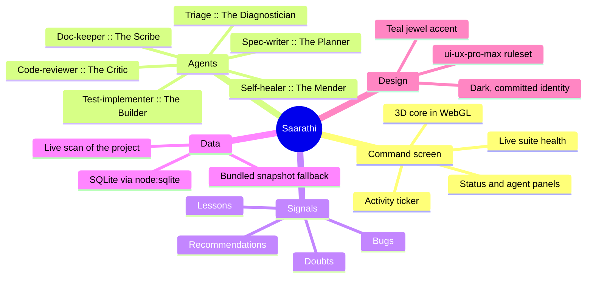
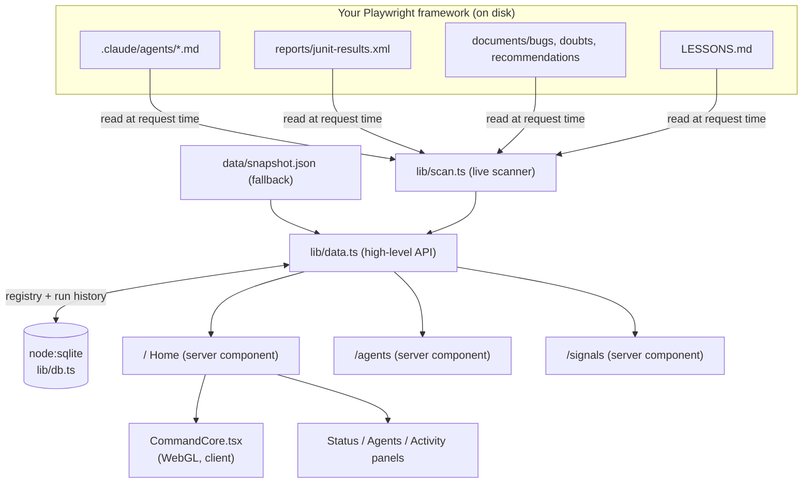

# Saarathi

**The command center for your Playwright automation.**

Saarathi is the charioteer: the one who guides. It does not run your tests itself,
it watches over the agents and the framework that do, and gives you one calm,
cinematic place to see the whole field. You go to Saarathi and ask for the status
of a project, and it answers with a live 3D command core, the agents by name, and
every signal your framework has recorded.

This is v0.1: a real, running application, wired to the real state of your
Playwright framework. It is a strong foundation, not the finished platform. The
honest map of what is built and what is next is in section 8.

---

## 1. What it is, in one picture



## 2. Run it

```bash
npm install
npm run dev
```

Open http://localhost:3000.

By default Saarathi runs on a **bundled snapshot** so it always shows something
real. To point it at your live Playwright framework, set one environment variable:

```bash
SAARATHI_PROJECT_PATH="/path/to/your/playwright-framework" npm run dev
```

When that folder exists, the top-left panel switches from `SNAPSHOT` to `LIVE`, and
every number, agent, and signal is read straight from that project's own files.

Optional:

```bash
SAARATHI_ENV=qa   # the environment label shown in the top bar (default: local)
```

A production build:

```bash
npm run build && npm run start
```

## 3. Architecture



The rule behind the whole design: **the cinematic core is client-side WebGL, and
everything you read is server-rendered and crisp.** A poster and a product at once.

## 4. Folder structure

```
web/
├── src/
│   ├── app/
│   │   ├── layout.tsx        Fonts, HUD frame, metadata
│   │   ├── page.tsx          Home: the 3D command core + live panels
│   │   ├── agents/page.tsx   The six agents, with personas
│   │   ├── signals/page.tsx  Bugs, doubts, recommendations, lessons, run history
│   │   └── globals.css       The whole design system as semantic tokens
│   ├── components/
│   │   ├── CommandCore.tsx   three.js command core (client, reduced-motion aware)
│   │   ├── Chrome.tsx        The top bar and frame on every screen
│   │   ├── NavLinks.tsx      Active-aware navigation
│   │   └── Clock.tsx         Live clock
│   ├── lib/
│   │   ├── scan.ts           Reads the real project state from disk
│   │   ├── db.ts             node:sqlite store (best-effort, never crashes)
│   │   ├── data.ts           The API the pages call
│   │   ├── config.ts         Which project Saarathi watches
│   │   ├── personas.ts       Agent names and personas for attribution
│   │   └── types.ts          Shared types
│   └── data/snapshot.json    Bundled real snapshot (fallback data)
└── .saarathi/saarathi.db     Created at runtime by node:sqlite
```

## 5. The data layer, honestly

- **Live first.** If `SAARATHI_PROJECT_PATH` points at a real project, Saarathi
  scans it: agent files, the JUnit results, the documents folder, and `LESSONS.md`.
  Nothing is invented. If your last run was 8 of 8 passing, that is what you see.
- **Snapshot fallback.** With no project configured, it renders a bundled snapshot
  captured from the real framework, so the app is never blank.
- **The database.** Saarathi uses Node's built-in SQLite (`node:sqlite`), which
  needs no install and no native compiler. It stores the project registry and the
  run history. It is entirely best-effort: on a Node version without SQLite, every
  database call becomes a safe no-op and the app keeps working from the live scan.
  The database can never break the product.

## 6. The design system

Dark by choice, not by default. A command center is watched, and on black the
glowing data reads at a glance. The identity:

- **One jewel accent**, teal `#33e2c6`, on a near-black ground. No AI-gradient.
- **Three typefaces**: Chakra Petch for HUD labels, Manrope for body, JetBrains
  Mono for data and IDs.
- **Semantic tokens only** (see `globals.css`), so nothing is a per-screen
  hardcoded color and a future theme is a token swap.

Built to the `ui-ux-pro-max` ruleset: visible focus rings, reduced-motion fallback
for the 3D core, empty and loading states, tabular figures for data, a defined
z-index scale, and a unified motion rhythm.

## 7. Accessibility and performance notes

- The 3D core respects `prefers-reduced-motion`: it draws a single static frame
  instead of animating.
- Fonts load from Google Fonts with system fallbacks, so the app still works
  offline (with fallback type).
- All data screens have real empty states.

## 8. What is built, and what is next (the honest line)

**Built and working in v0.1:**
- The 3D command core, in real WebGL, wired to live suite health.
- Live scan of a real Playwright project (agents, run results, documents, lessons).
- The Agents screen with personas, and the Signals screen with real records.
- A local SQLite database for the registry and run history.
- A clean, accessible, dark design system.

**Not yet built (the roadmap):**
- The **Orchestrator**: actually running the agent pipeline from Saarathi, not just
  displaying it. This is the biggest next step.
- Multi-project registry in the UI (the data layer already supports it; the
  switcher is a single project for now).
- Live-updating panels while a run is in progress (currently a value per request).
- Trace analysis and executive summaries on demand.
- Approval actions in the UI for gated agent steps (self-healer, code changes).

Saarathi v0.1 is the calm, honest foundation. The command core is real, the data is
real, and the path from here is written down, not hand-waved.
